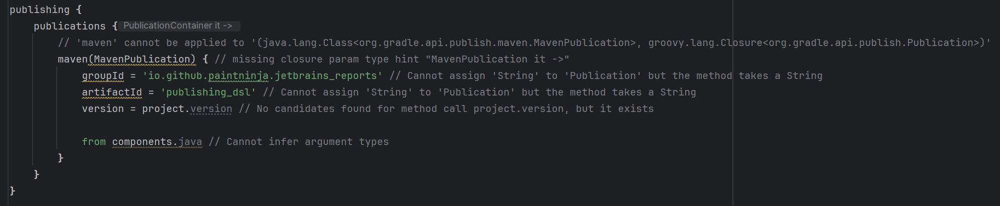
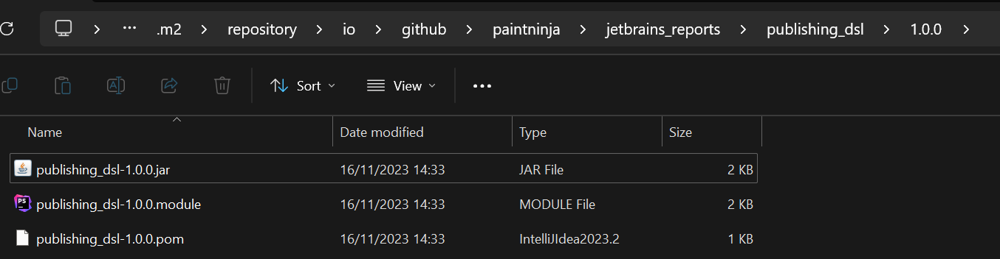

## Gradle publishing DSL
Houses code for reproducing a bug with the Gradle publishing Groovy DSL in IntelliJ.

Lots of IDE errors and warnings are shown in the IDE; however, publishing works fine:

- Buildscript: `build.gradle`
- Publish with: `gradlew publishToMavenLocal`
